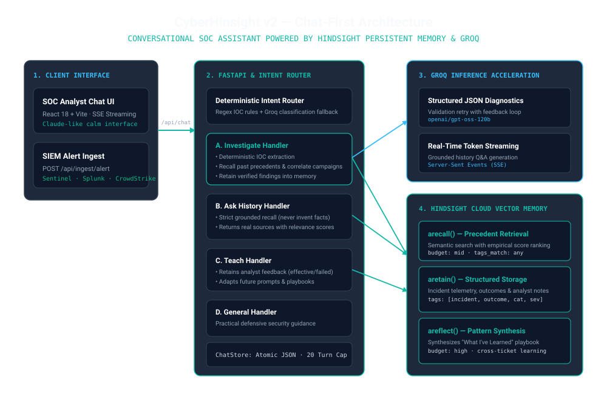

# 🛡️ CyberHinsight

> **Defensive AI Security Incident Response Agent with Persistent Hindsight Memory**
>
> CyberHinsight transforms enterprise cybersecurity operations from stateless LLM playbooks into an autonomous SOC investigation agent. Powered by **Hindsight Cloud** persistent agent memory and **Groq** sub-second inference, CyberHinsight recalls past investigations, correlates multi-week adversary campaigns, and actively learns from containment outcomes to deliver context-aware defenses.

---

## 🚨 The Problem in Numbers

* **SOC Alert Fatigue**: Enterprise SOC teams triage over **10,000 security alerts weekly**, spending an average of **26 minutes per incident**.
* **Organizational Amnesia**: Many recurring security incidents share underlying adversary infrastructure (reused C2 IP ranges, macro droppers, credential harvesters), yet traditional LLMs analyze each alert in total isolation with zero knowledge of past tickets.
* **Flawed Generic Playbooks**: Generic AI assistants recommend cookie-cutter advice (e.g., "reset password") that fails in real environments where active session tokens must be revoked or where unisolated reboots allow malware persistence.

---

## 💡 The Solution: CyberHinsight with Hindsight Memory

```
Security Alert / SIEM Webhook
         ↓
Deterministic IOC Extractor (Regex for IPv4/CIDR, Hashes, Domains, Hostnames)
         ↓
Hindsight Cloud Vector Memory (client.arecall with Empirical Ranking Scores)
         ↓
Campaign Linker & Escalation Forecast (Correlates Subnets & Predicts Mutation)
         ↓
Groq LLM Acceleration (Memory-Aware Prompt with Delimiter Hardening)
         ↓
Autonomous Defense Recommendations (Citing Past Precedents & Avoiding Failed Actions)
         ↓
Hindsight Retain (Upserts Incident Memory & Analyst Outcome Feedback)
```

---

## 🏛️ System Architecture



| Layer | Component | Technology | Purpose |
|---|---|---|---|
| **Presentation** | SOC Dashboard Console | React 18 + Vite | Real-time telemetry, 6-step progress stepper, side-by-side Before/After comparison, empirical learning curve |
| **Orchestration** | Security Agent Core | Python 3.13 + FastAPI | Asynchronous pipeline, IOC extraction, campaign correlation, Pydantic validation, auth |
| **Inference** | Sub-Second Diagnostics | Groq Cloud | `openai/gpt-oss-120b` (Primary) with `qwen/qwen3-32b` (Fallback) |
| **Agent Memory** | Persistent Vector Bank | Hindsight Cloud | `aretain`, `arecall`, `areflect`, `aset_mission` (Bank: `cyberhinsight`) |

---

## ⚡ Quick Start Guide

### Prerequisites
* **Python**: 3.11+ (Python 3.13 supported)
* **Node.js**: 18+ and npm 9+
* **Groq API Key**: [console.groq.com](https://console.groq.com)
* **Hindsight Cloud Account**: [ui.hindsight.vectorize.io](https://ui.hindsight.vectorize.io/signup)

---

### Backend Setup

```bash
# 1. Navigate to backend directory
cd backend

# 2. Create virtual environment
python -m venv .venv

# 3. Activate virtual environment
# Windows:
.venv\Scripts\activate
# Linux / macOS:
source .venv/bin/activate

# 4. Install dependencies
pip install -r requirements.txt
pip install -r requirements-dev.txt

# 5. Configure environment
cp .env.example .env
# Edit .env with your GROQ_API_KEY and HINDSIGHT_API_KEY

# 6. Start backend server
uvicorn app.main:app --reload --port 8000
```

---

### Frontend Setup

```bash
# 1. Navigate to frontend directory
cd frontend

# 2. Install dependencies
npm install

# 3. Launch Vite development server
npm run dev
```

Visit [`http://localhost:5173`](http://localhost:5173) in your browser.

---

## ⚙️ Environment Variables

Configure these settings in `backend/.env`:

| Variable | Type | Default | Description | Required |
|---|---|---|---|---|
| `GROQ_API_KEY` | `str` | *None* | Groq Cloud API key for ultra-fast LLM inference | **Yes** |
| `HINDSIGHT_API_KEY` | `str` | *None* | Hindsight Cloud API key for agent memory | **Yes** |
| `HINDSIGHT_BASE_URL` | `str` | `https://api.hindsight.vectorize.io` | Hindsight API base URL | **Yes** |
| `HINDSIGHT_BANK_ID` | `str` | `cyberhinsight` | Memory bank identifier | **Yes** |
| `LLM_MODEL` | `str` | `openai/gpt-oss-120b` | Primary Groq model for incident analysis | **Yes** |
| `LLM_FALLBACK_MODEL` | `str` | `qwen/qwen3-32b` | Fallback model if primary encounters rate limits | No |
| `APP_API_KEY` | `str` | *Empty* | Optional API key protecting write endpoints (`X-API-Key`). Leave empty for dev mode. | No |
| `CORS_ORIGINS` | `str` | `http://localhost:5173,http://127.0.0.1:5173` | Comma-separated list of allowed CORS origins | No |
| `MAX_INCIDENT_CHARS` | `int` | `8000` | Maximum allowed character length for incident descriptions | No |

---

## 📡 Complete REST API Endpoints

All endpoints are validated with Pydantic v2 schemas:

### Investigation & Incident Store
| Method | Path | Description | Auth |
|---|---|---|---|
| `POST` | `/api/incidents/investigate` | Investigate an incident narrative or EDR log (with or without memory) | Optional API Key |
| `POST` | `/api/incidents/{incident_id}/feedback` | Submit analyst outcome feedback (`effective`, `ineffective`, etc.) | Optional API Key |
| `GET` | `/api/incidents/history` | Retrieve full history of investigated incidents | Public |
| `GET` | `/api/incidents/stats` | Retrieve aggregate metrics (by severity, category, recent feed) | Public |
| `GET` | `/api/incidents/{incident_id}` | Retrieve details of a specific incident | Public |
| `POST` | `/api/incidents/seed` | Seed synthetic incidents into memory and history | Optional API Key |
| `POST` | `/api/incidents/reset` | Clear incident history store | Optional API Key |

### Hindsight Agent Memory
| Method | Path | Description | Auth |
|---|---|---|---|
| `POST` | `/api/memory/search` | Execute semantic vector search across memory bank with empirical scores | Public |
| `GET` | `/api/memory/playbook` | Synthesize "What Works Here" learned playbook via `areflect()` | Public |
| `POST` | `/api/memory/reflect` | Arbitrary pattern reflection across historical incident memories | Public |
| `GET` | `/api/memory/stats` | Check memory bank connection and identifier | Public |
| `POST` | `/api/memory/retain` | Directly retain custom knowledge into Hindsight | Optional API Key |

### SIEM Ingestion Webhook
| Method | Path | Description | Auth |
|---|---|---|---|
| `POST` | `/api/ingest/alert` | Ingest SIEM alerts (Sentinel, Splunk, CrowdStrike format) | Optional API Key |

### Demo Evaluation & Learning Curve
| Method | Path | Description | Auth |
|---|---|---|---|
| `POST` | `/api/demo/new-session` | Create a clean, isolated memory bank for cold-start demo testing | Optional API Key |
| `POST` | `/api/demo/run-sequence` | Run automated 6-incident evaluation benchmark computing specificity scores | Optional API Key |
| `GET` | `/api/demo/sequence-results` | Retrieve sequence results for the Learning Curve chart | Public |

### System Health
| Method | Path | Description | Auth |
|---|---|---|---|
| `GET` | `/api/health` | Cached health check for Groq and Hindsight connectivity | Public |
| `GET` | `/` | API status and root greeting | Public |

---

## 🎬 Deterministic 60-Second Demo Script

To experience CyberHinsight in action:

1. **Cold Start**: Click **"Fresh Cold Start"** on the Investigation Console. This initializes an empty memory bank (`cyberhinsight-demo-<timestamp>`).
2. **Act 1 (Baseline)**: Select **Act 1** (`FIN-WS-042` phishing with `198.51.100.45`). Click **"Investigate Incident"**:
   - The agent performs initial extraction.
   - Hindsight reports: *"First Incident of this Pattern (Baseline Memory)"*.
   - Click **"Effective"** on the outcome feedback bar to record that host isolation succeeded.
3. **Act 2 (Recall & Campaign Link)**: Select **Act 2** (`FIN-WS-088` secondary attack in same `198.51.100.0/24` subnet). Click **"Investigate Incident"**:
   - The cyan **Hindsight Historical Recall** card highlights `DEMO-001` with an empirical relevance score (e.g. `Score: 0.87 · Rank #1`).
   - The **Adversary Campaign Correlated** panel highlights `CMP-19851100`, linking 2 Finance endpoints across the shared subnet.
   - Recommendations adapt dynamically from individual host blocking to a **perimeter subnet block**.
4. **Before vs. After View**: Click **"⚡ Before / After Memory Comparison"** to see a side-by-side comparison proving how Hindsight memory eliminates generic steps.
5. **Learning Curve**: Open the **Agent Learning Curve** tab and click **"Run 6-Incident Sequence"** to view the empirical line chart tracking specificity scores from 2.5 to 8.5/10.

---

## 🧪 Automated Test Suite

CyberHinsight includes 14 unit tests with zero external network dependencies using test doubles (`FakeLLM` and `FakeMemory`):

```bash
# Run all tests
cd backend
.venv/Scripts/python -m pytest -q tests
```

### Verified Test Cases:
1. `test_no_retain_on_llm_failure`: When LLM analysis fails, Hindsight `retain` is never called and API returns HTTP 502.
2. `test_recall_influences_prompt`: Memory-aware prompts include recalled context in `<memory>` tags; memory-off prompts omit them.
3. `test_baseline_does_not_retain_or_recall`: `use_memory=False` skips both recall and retain.
4. `test_successful_investigation_retains_structured_memory`: Retained records include stable `document_id`, tags, and IOCs.
5. `test_ioc_extractor`: Deterministic extraction of IPv4, /24 CIDRs, domains, SHA256/MD5 hashes, and hostnames.
6. `test_campaign_linking_exact_ip_strong`: Exact IP matches produce strong campaign links (`CMP-xxxxxxxx`).
7. `test_campaign_linking_subnet_moderate`: /24 subnet overlap produces moderate campaign links.
8. `test_campaign_linking_unrelated_none`: Unrelated incidents produce no campaign link.
9. `test_escalation_prediction_grounded`: Predicts ransomware escalation based on memory evidence.
10. `test_feedback_retains_outcome_doc`: Submitting feedback creates an `outcome` document in Hindsight.
11. `test_webhook_normalisation`: SIEM alerts normalize to standard investigation descriptions.
12. `test_auth_rejection_when_key_configured`: Rejects unauthenticated requests with HTTP 401 when `APP_API_KEY` is set.
13. `test_oversize_input_rejected`: Descriptions exceeding `MAX_INCIDENT_CHARS` return HTTP 422.
14. `test_empty_description_rejected`: Empty inputs return HTTP 422.

---

## 🔒 Defensive Security & Ethics Statement

CyberHinsight is strictly a **defensive incident-response tool**:
- It contains **no offensive capabilities**, exploit modules, or malware generation functionality.
- All IP addresses in sample datasets utilize reserved documentation blocks specified in **RFC 5737** (`192.0.2.0/24`, `198.51.100.0/24`, `203.0.113.0/24`).
- All telemetry, hostnames, and user identities are 100% synthetic.

---

## 📄 License

Apache 2.0 License.
